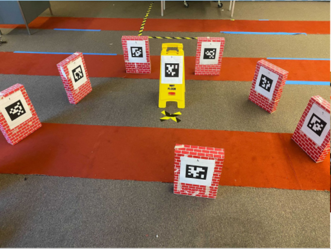
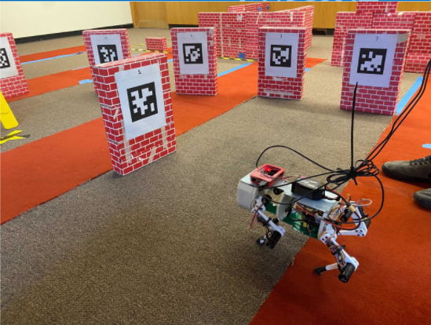

# Testing

## Setup
* We tested with 16 printed `0.03 meter` fiducials and a floor sign to hold the goal fiducial

### Requirements
* A Pupper 2.0 robot flashed with the low level Teensey software for the motor controllers
* A successful calibration and correctly configured motor IDs 
* The RaspberryPi and RaspberryPi camera running with the latest software 

## Running
* Running the test is simple, once you have the calibrated pupper robot operating you can then run `python3 /src/main.py` 

## Unit Testing
* A test for the boundary generation, discretization, and graph search can be run through `python3 /src/path_test.py`
* This opens a `pickled Environment` object containing obstacle, agent, and goal data from a testing session and then performs a graph search using the `PathFinder` class 

