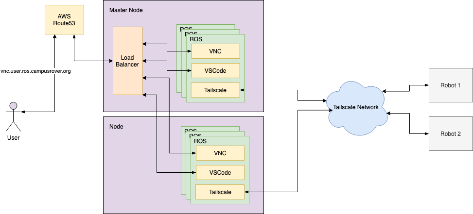

# Architecture

## Overview

The cloud desktop architecture is simple. It leverages docker for container runtime and K8s fo scheduling.

## Cloud Desktop Container

The cloud desktop container (also known as `tb3-ros`) is the docker container image we use. It is mainly consists of 3 components.

- VNC server paired with a NoVNC server
- VSCode server
- Tailscale client

### Supervisord

Each of the components are managed by a process control system called `supervisord`. Supervisor is responsible for spawning and restarting these components. For detailed configs, see [supervisord.conf](https://github.com/pitosalas/tb3-ros/blob/61c393140da2dbcff15fa48f0ba9c6435d5ff94c/tb3-ros/files/supervisor/supervisord.conf).

### Dockerfile

The dockerfile for the cloud desktop container can be found on GitHub [here](https://github.com/pitosalas/tb3-ros/tree/master/tb3-ros).

## Networking

Each container has access to 2 networks. One is created by K8s, one created by Tailscale.

K8s network is used for communication with the load balancer to allow each container to be accessible from a URL.

Tailscale network is used for communication and control of robots globally.
