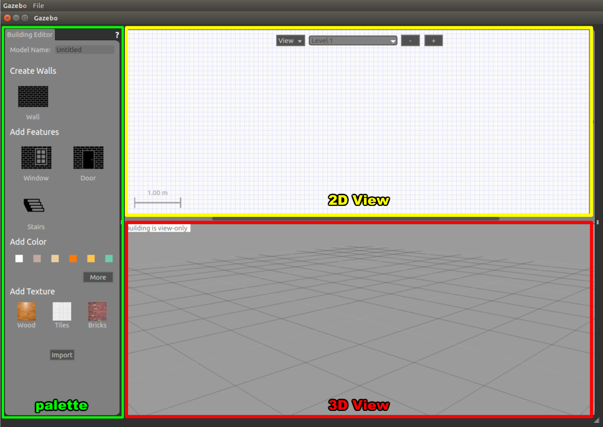
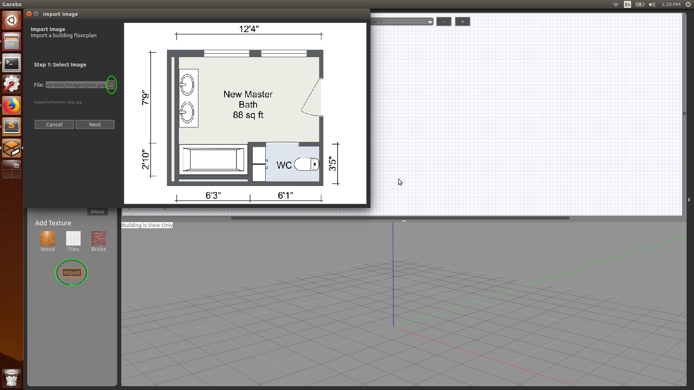
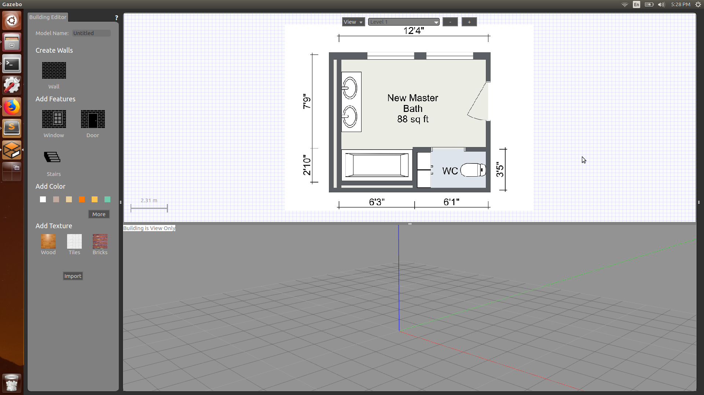
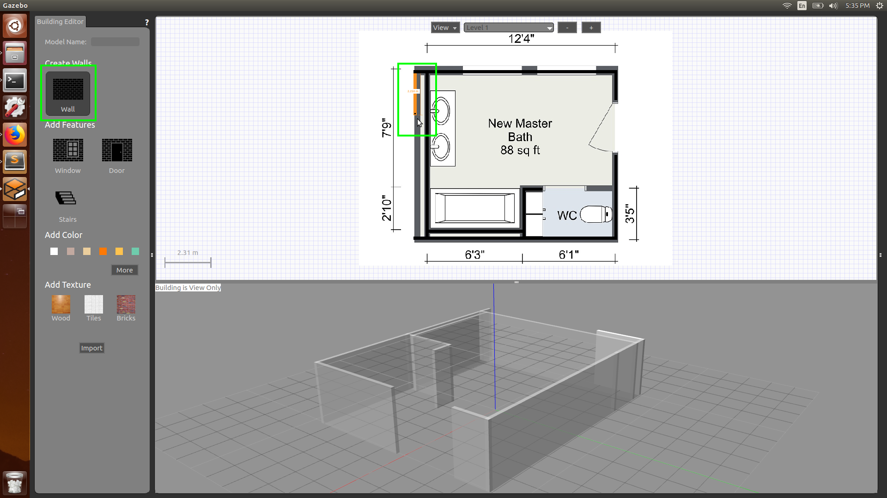
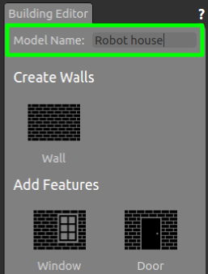

# Tutorial

## 1. Open a Gazebo simulation

First, open Gazebo - either search for gazebo in the Unity Launcher GUI or simply type `gazebo` onto the terminal. Click on `Edit` --&gt; `Building Editor` and you should see the following page. Note there are three areas:

* **Platte:** You can choose models that you wish to add into the map here.
* **2D View:** The only place you make changes to the map.
* **3D View:** View only.



## 2. Import a floor plan

You may create a scene from scratch, or use an existing image as a template to trace over. On the Platte, click on `import` and selet a 2D map plan image in the shown prompt and click on `next`.



To make sure the walls you trace over the image come up in the correct scale, you must set the image's resolution in pixels per meter _\(px/m\)_. To do so, click/release on one end of the wall. As you move the mouse, an orange line will appear as shown below. Click/release at the end of the wall to complete the line. Once you successfully set the resolution, click on `Ok` and the 2D map plan image you selected should show up in the 2D-View area.



## 3. Add & Edit walls

* Select **Wall** from **Platte**.
* On the **2D View**, click/release anywhere to start the wall. As you move the mouse, the wall's length is displayed.
* **Click again** to end the current wall and start an adjacent wall.
* **Double-click** to finish a wall without starting a new one.
* **Double-clicking on an existing wall** allows you to modify it.

  You can manipulate other models likewise. For more detailed instructions, please refer to [http://gazebosim.org/tutorials?tut=build\_world](http://gazebosim.org/tutorials?tut=build_world) for more details



## 4. Prepare a package

You need to create a package for your Gazebo world so that you can use `roslaunch` to launch your it later.

* Go to your catkin workspace

  `$ cd ~/catkin_ws/src`

* Create a package using the following command.

  `$ catkin_create_pkg ${your_package_name}`

* Go to your package and create three folders **launch**, **worlds** and **models**.

  ```sh
  cd ${your_package_name}
  mkdir launch}
  mkdir worlds
  mkdir models
  ```

## 5.Save your map

Once you finish editing the map, give a name to your model on the top on the **Platte** and click on `File` -&gt; `Save As` to save the model you just created into `../${your_package_name}/models`.



Click on `File` -&gt; `Exit Building Editor` to exit. **Please note that once you exit the editor, you are no longer able to make changes to the model.** Click on `File` -&gt; `Save World As` into `../${your_package_name}/worlds`.

I will refer to this world file as `${your_world_file_name}.world` from now on.

## 6.Create a launch file for your gazebo map

Go to `../${your_package_name}/launch` and make a new file `${your_launch_file}` Copy and paste the following code into your launch file and substitute `${your_package_name}` and `{your_world_file_name}` with their actual names.

```xml
 <launch>
    <arg name="model" default="$(env TURTLEBOT3_MODEL)" doc="model type [burger, waffle, waffle_pi]"/>
    <arg name="x_pos" default="0.0"/>
    <arg name="y_pos" default="0.0"/>
    <arg name="z_pos" default="0.0"/>
    <include file="$(find gazebo_ros)/launch/empty_world.launch">
        <arg name="world_name" value="$(find ${your_package_name})/worlds/${your_world_file_name}.world"/>

        <arg name="paused" value="false"/>
        <arg name="use_sim_time" value="true"/>
        <arg name="gui" value="true"/>
        <arg name="headless" value="false"/>
        <arg name="debug" value="false"/>
    </include>

     <param name="robot_description" command="$(find xacro)/xacro.py $(find turtlebot3_description)/urdf/turtlebot3_$(arg model).urdf.xacro" />

     <node name="spawn_urdf" pkg="gazebo_ros" type="spawn_model" args="-urdf -model turtlebot3_$(arg model) -x $(arg x_pos) -y $(arg y_pos) -z $(arg z_pos) -param robot_description" />
</launch>
```

## 7. Test

Go to the workspace where your new package was created **e.g.** `cd ~/catkin_ws`

run `catkin_make` and then `roslaunch ${your_package_name} ${your_launch_file}`

You should see the Gazebo map you just created along with a turtlebot loaded.

## Using the Model Editor instead

The building editor is a faster, easier to use tool than the model editor, as it can create a map in mere minutes. With the model editor, you have more technical control over the world, with the trade off being a more tedious process. The model editor can help make more detailed worlds, as you can import .obj files that can be found on the internet or made in 3d modeling software such as Blender. For the purposes of use in this class, **USE THE BUILDING EDITOR** For your own recreational robotic experimentation purposes, of course, do whatever you like.

If you do wish to use the model editor, here are two tips that will help you to get started making basic, serviceable worlds.

### 1. Change the Color

The basic shapes that gazebo has are a greyish-black by default- which is difficult to see on gazebo's greyish-black background. To change the color, follow these steps: 1. Right click on the model 1. select "open link inspector" 1. go to the "visual" tab 1. scroll down to "material" and open that section 1. use the RGB values labeled "ambient" to alter the color - set them all to 1 to make it white.

### 2. Alter the shape

use the shortcut s to open the scaling tool - grab the three axis to stretch the shape. Hold ctrl to snap it to the grid. use the shortcut t to switch to the translation tool - this moves the model around. Hold ctrl to snap it to the grid. use the shortcut r to open the rotation tool. grab the rings to rotate the object.

### 3. Make it Static

If an object isn't static, it will fall over/ obey the laws of physics if the robot collides with it - to avoid this, click the object in the left hand menu and click the is\_static field.

### 4. Use the Building Editor instead

Does the model editor seem like a hassle already? Then just use the building editor.
