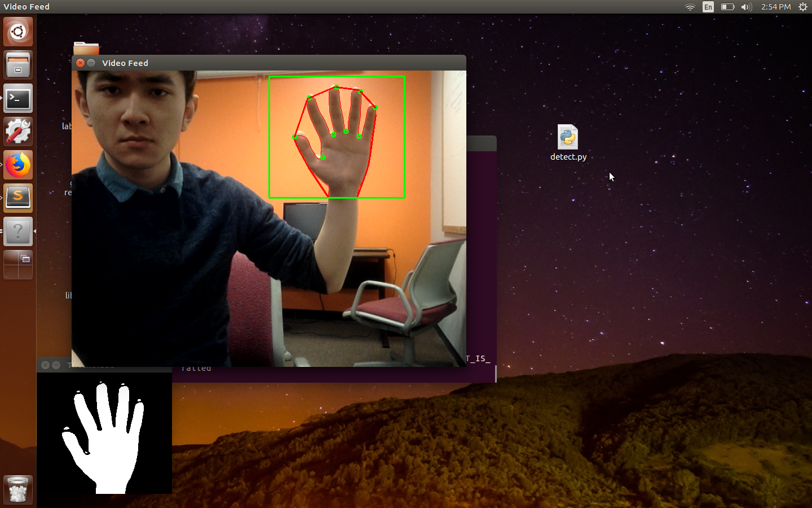
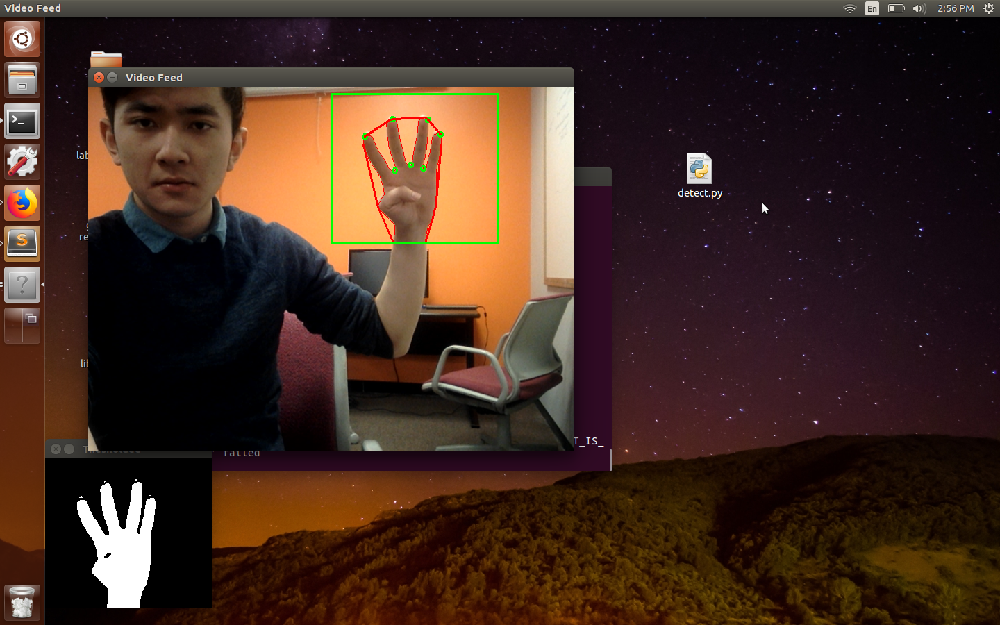
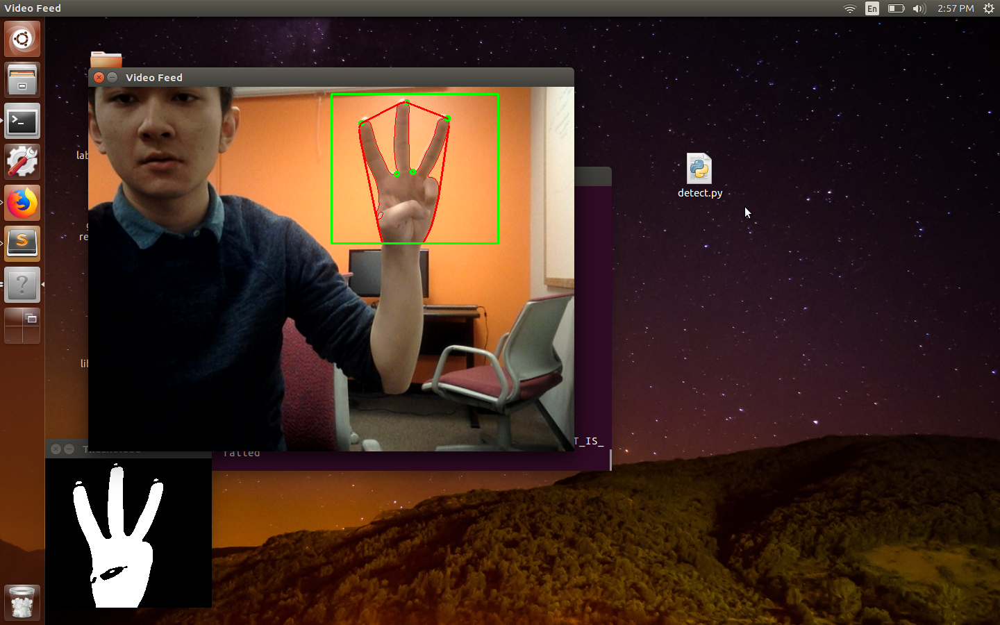
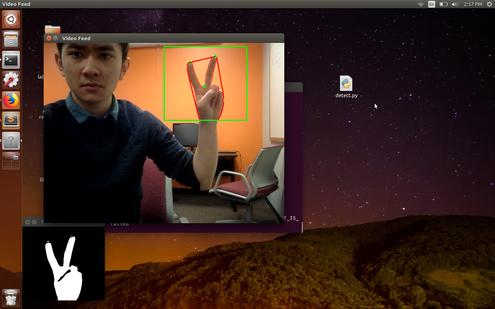

# Explicit Features Approach \(counting fingers\)

s\#\#\# Hand Gesture Recognition After reaching the dead-end in the previous approach and being inspired by several successful projects \(on Github and other personal tech blogs\), I implemented an explict-feature-driven hand recognition algorithm. It relies on background extraction to "extract" hands \(giving gray scale images\), and based on which compute features to recognize the number of fingers. It worked pretty well if the camera and the background are ABSOLUTELY stationary but it isn't the case in our project: as the camera is mounted on the robot and the robot keeps moving \(meaning the background keeps changing\). Code can be founded [here](https://github.com/campusrover/count_fingers)

## References

[Opencv python hand gesture recognition](http://creat-tabu.blogspot.com/2013/08/opencv-python-hand-gesture-recognition.html)

[Hand Tracking And Gesture Detection](https://s-ln.in/2013/04/18/hand-tracking-and-gesture-detection-opencv/)

### Dependencies Overview

* OpenCV
* ROS Kinetic \(Python 2.7 is required\)
* A Camera connected to your device

### How to Run

1. Copy this package into your workspace and run `catkin_make`.
2. Simply Run `roslaunch gesture_teleop teleop.launch`. A window showing real time video from your laptop webcam will be activated. Place your hand into the region of interest \(the green box\) and your robot will take actions based on the number of fingers you show. 1. Two fingers: Drive forward 2. Three fingers: Turn left 3. Four fingers: Turn right 4. Other: Stop









### Brief Explaination towards the package

This package contains two nodes.

1. `detect.py`: Recognize the number of fingers from webcam and publish a topic of type `String` stating the number of fingers. I won't get into details of the hand-gesture recognition algorithm. Basically, it extracts the hand in the region of insteret by background substraction and compute features to recognize the number of fingers.
2. `teleop.py`: Subscribe to `detect.py` and take actions based on the number of fingers seen.

   ```python
   while not rospy.is_shutdown():
    twist = Twist()
    if fingers == '2':
        twist.linear.x = 0.6
        rospy.loginfo("driving forward")
    elif fingers == '3':
        twist.angular.z = 1
        rospy.loginfo("turning left")
    elif fingers =='4':
        twist.angular.z = 1
        rospy.loginfo("turning right")
    else:
        rospy.loginfo("stoped")
    cmd_vel_pub.publish(twist)
    rate.sleep()
   ```

### Later Plan

1. Using Kinect on mutant instead of local webcam.
2. Furthermore, use depth camera to extract hand to get better quality images
3. Incorporate **Skeleton tracking** into this package to better localize hands \(I am using **region of insterests** to localize hands, which is a bit dumb\).
