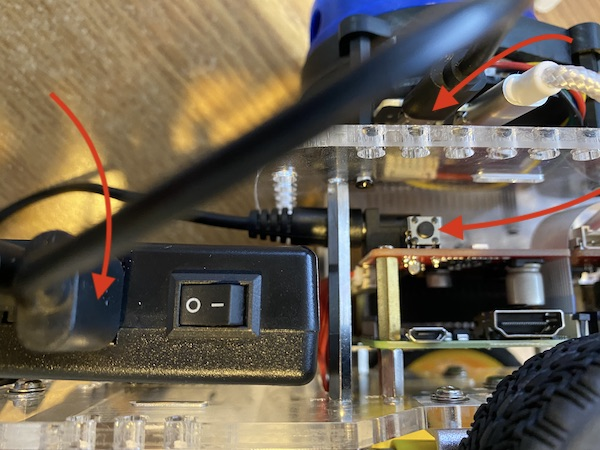

## Using the MiniRover

### Turning it on

It is important that you follow a rigid procedure when turning the robot on and off.

Assuming it is totally off:

1. Make sure the battery pack is correctly connected to the robot.

1. Switch on the battery pack

1. Click the micro button on the red board



### Turning it off

1. From your ssh command line on the remote computer, type `sudo shutdown now`

1. Once the Raspberry Pi has stopped blinking you can turn off the power switch on the battery pack

### rset command

We've implemented a very simple tool to set up the IP addresses correctly. It will be changing as I figure out how to make it better. So for now...

1. If you have a cloud desktop and want to run simulations without a actual miniRover" `rset cloud`
1. If you have a cloud desktop add a real robot, run `rset robot` on your cloud desktop and `rset pi` on the  actual miniRover (over ssh)
1. If you have a local docker based desktop, run `rset docker` there.

rset by itself displays the current satus

(I know a combination is missing and plan a revision of this)

### Starting the MiniRover ROS applications

Note that all we run on the MiniRover itself are roscore, and the nodes needed for the motors, lidar and camera. Everything else runs on your "remote". On the actual miniRover (using ssh) do this:

````
roslaunch gpg_bran gpg_ydlidar.launch # launch the motor controller and lidar
```

You often don't need the camera, but if you do then also do this

```
roslaunch gpg_bran raspicam.launch 
```
### Working from your browser desktop

Note that this includes all flavors, cloud based, local docker based, and gpu based browser desktops. If you just want to use the simulators on their own and are not using an actual miniRover, then: `rset cloud` is enough. At that point you can run your ROS programs.

### ROS launch files

This is a list that grows and changes. So I am just listing the key ones.


