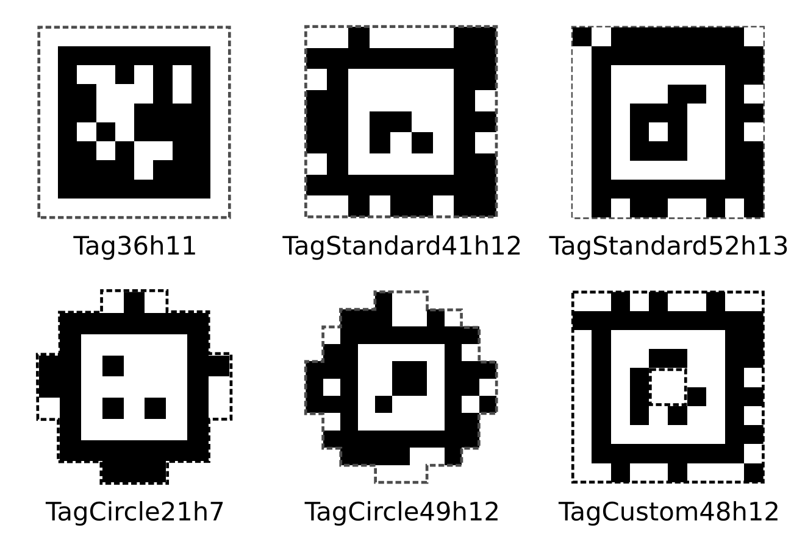

# Fiducial Detection

## Raspicam
* We use a RaspberryPi v1 camera whose full documentation can be found at [Raspicam Docs](https://www.raspberrypi.org/documentation/hardware/camera/), this also includes hardware and software specs 
* Additional information on how to install Raspicam hardware can be found at [Raspicam Installation](https://thepihut.com/blogs/raspberry-pi-tutorials/16021420-how-to-install-use-the-raspberry-pi-camera)

## AprilTags
* We use the `pupil_apriltags` package to detect fiducials in the Raspicam image so full documentation for the AprilTags can be found at [Pupil AprilTags](https://pypi.org/project/pupil-apriltags/)
* The package works by taking the camera paramters, fiducial size and family, and additional fiducial detection paramters and creating a `detector` class which contains a `detect` method that inputs a camera frame and outputs a list of detected fiducials
* In order to print new apriltags you have to follow the instructions at [AprilTag Generation](https://github.com/AprilRobotics/apriltag-generation) and [Premade AprilTags](https://github.com/AprilRobotics/apriltag-imgs)

## Paramters and Tuning
* The `params.yaml` file contains all of the fiducial vision paramters
* The camera paramters which are used in the `params.yaml` file were found online in the raspicam section
* The size of the fiducial in meters can be adjusted by printing out new fiducials of a larger size 

## Transformation Math
* The `src/transforms.py` and `src/geometry.py` contain the methods used for transforming the fiducial detection results into easier to work with translations and rotations 
* Also, paramters in `params.yaml` are used to slightly adjust the detection results after transformation

