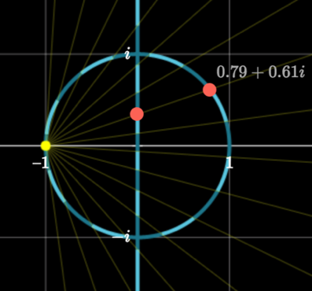

### Gen 2: Quaternions and Rotation Cheat Sheet

Quaternions are points on the
4D unit hypersphere.  Four-dimensional complex numbers are always of the form:

### a + b *i* + c *j* + d *k*

…with one real part ‘a’, and 3  **imaginary** or **vector** parts ‘b’, ‘c’, and ‘d’.  Since all quaternions fall on the unit hypersphere, it will always have a distance 1 from the origin. They therefore maintain the following relationship:

### a^2 + b^2 + c^2 + d^2 = 1

If X and Y are two quaternions that satisfy the above rule, XY will also satisfy it.

Since quaternions are extensions of complex numbers, we can multiply them by
distribution, but this requires stronger definitions of i, j, and k and their
multiplication.  These relationships can be easily remembered with the
right-hand-rule.

Now we can multiply the quaternions by distribution. 
This can be simplified to the following equation, known as the *Hamilton
product*:

### (a1 + b1<i>i</i> + c1<i>j</i> + d1<i>k</i>) * (a2 + b2<i>i
</i>+ c2<i>j</i> + d2<i>k</i>) =

In order to form a 3D representation of our 4D quaternion, we use a <i>stereographic projection</i>,
which draws lines through the point (-1, 0, 0, 0) and every other one on the
hypersphere.  Wherever these lines intersect the 3D space is their projection
onto it (2D projection into a 1D space shown below):

Yellow lines are drawn originating at -1 + 0<i>i</i> and intersect with every point on the unit
circle.   The point at which the line intersects the <i>i</i>-line is where the
point is projected onto the 1D line.  Here, you can see the 2D point 0.79 +
0.61<i>i</i> onto the point ~0.4.

All these elements combined allow us to use quaternions to define a robot’s (or any other 3D object’s) orientation in 3D space.  Instead of adding rotations, we use the *Hamilton product* to combine quaternions (since we are working one dimension up). 
The dimensionality of the rotation is best visualized as a rotation Q around a *Euler axis* (a 3D unit vector).  A quaternion *q*, which describes a rotation Q< around the unit vector <i>u</i>,
is given as:

#### Useful Links
* https://eater.net/quaternions
* https://en.wikipedia.org/wiki/Quaternion
* https://en.wikipedia.org/wiki/Quaternions_and_spatial_rotation
* https://en.wikipedia.org/wiki/Stereographic_projection
