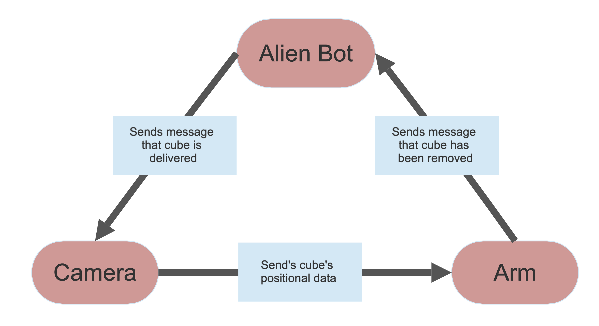
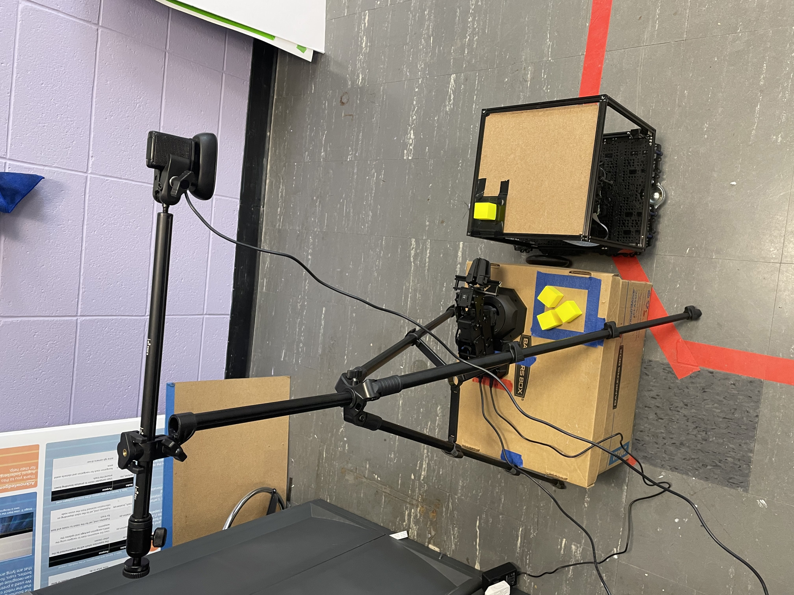
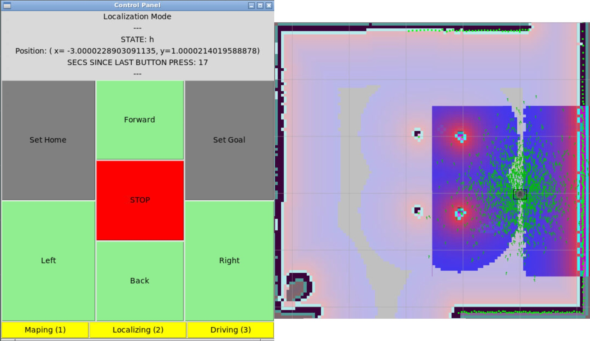

---
title: Cargo Claw
type: report
date: may-2023
author: Benjamin Blinder, Ken Kirio, Vibhu Singh
status: new
--- 
# Cargo Claw

* Benjamin Blinder benjaminblinder@brandeis.edu  
* Ken Kirio kenkirio@brandeis.edu  
* Vibhu Singh vibhusingh@brandeis.edu  

* [Github Repository](https://github.com/campusrover/cargoclaw**)

## Introduction

### Problem Statement

The project coordinates a stationary arm robot and a mobile transportation robot to load and unload cargo autonomously. We imagine a similar algorithm being used for loading trucks at ports or in factory assembly lines.

### Demonstration

[Watch the demo](https://drive.google.com/file/d/1pIHoIOvNj1FLkFAyZMQcKKy8nnaWH4aA/view?usp=share_link)  

There are three phases: mapping, localization, and delivery.  

First, the robot drives around and makes a map. Once the map is made, a person will manually drive the robot to a delivery destination and press a button to indicate its location to the robot. Then the person will manually have to drive the robot back to the loading point and mark that location as well. With this setup, the robot can start working as the delivery robot and transporting cubes from the loading zone to the arm.  

In the delivery phase, a person loads a piece of cargo - we used a 3D printed cube - onto the robot and then presses a button to tell the robot that it has a delivery to make. Once there, computer vision is used to detect the cargo and calculate its position relative to the arm. Once the arm receives the coordinates, it determines what command would be necessary to reach that position and whether that command is physically possible. If the coordinates aren’t valid, the transportation robot attempts to reposition itself so that it is close enough for the arm. If the coordinates are valid, the arm will then grab the cube off the loading plate on the robot and place it in a specified go. Finally, the transportation robot will go back to the initial home zone, allowing the process to repeat.

### Learning Objectives

- Mapping
  - Create a map
  - Localize on a premade map
  - Perform autonomous navigation between two fixed points
- Image processing
  - Recognize the cargo
  - Calculate the physical location of the cargo
- Robotic arm
  - Coordinate commands on a robot that does not run ROS natively

### Literature

* [ROS Navigation Tuning](https://kaiyuzheng.me/documents/navguide.pdf)

## What Was Created

A flowchart of message passing that must occur between the three main components of this project.

## Algorithms & Techniques

### Mapping: SLAM, AMCL, move_base

We needed the robot to be able to move autonomously and orient itself to the arm, so we decided to use SLAM to create a map and the AMCL and move_base packages to navigate. Using SLAM, we use the LiDAR sensor on the robot to create a map of the room, making sure we scan clear and consistent lines around the arm and the delivery zone. We then save the map and use AMCL to generate a cost map. This also creates a point cloud of locations where the robot could be according to the current LiDAR scan. Then, we manually moved the robot through the map in order to localize the robot to the map and ensure accurate navigation. We then capture the position and orientation data from the robot for a home and delivery location, which is then saved for future navigation. Finally, we can tell the robot to autonomously navigate between the two specified locations using the move_base package which will automatically find the fastest safe route between locations, as well as avoid any obstacles in the way.

### Image Processing: color filtering, conversion to physical units, transformation to arm commands

Cargo is detected via color filtering. We filter with a convolutional kernel to reduce noise, then pass the image through bitwise operators to apply the color mask. The centroid is converted from pixels to physical units by measuring the physical dimensions captured by the image.

Since commands to the arm are sent in polar coordinates, the cartesian coordinates obtained from the image are then converted into polar. These coordinates must then be transformed into the units utilized by the arm, which have no physical basis. We took measurements with the cargo in various positions and found that a linear equation could model this transformation, and utilized this equation to determine the y-coordinate. However, the x-coordinate could not be modeled by a linear equation, as the arm's limited number of possible positions along this axis made it impossible to determine a strong relationship between the coordinates. In addition, whether the cargo was parallel or at an angle to the arm affected the location of the ideal point to grab on the cargo. Instead we calculated the x-position by assinging the position and orientation of the cargo to states, which were associated with a particular x-coordinate.

## How to Run

### Setup

1. Arm robot  

The arm robot needs to be elevated so that it can pick up the cube. Ensure that the setup is stable even when the arm changes positions, using tape as necessary. Determine the z-command required to send the arm from the "home" position (see [Veronika's guide to manually controlling the arm](https://campus-rover.gitbook.io/lab-notebook/brandeis-robotics-utilities/connect-to-robo)) to the height of the cargo when it is loaded on the transportation robot. This will be one parameter of the launch file.

2. Camera  

The camera should be set in a fixed position above the loading zone, where the lens is parallel to the ground. The lab has a tripod for such purposes. Record the resolution of the image (default 640x480) and the physical distance that the camera captures at the height of the cargo when placed on the transportation robot. These will also be parameters for the launch file.

### Execution

Run `roslaunch cargoclaw transport_command.launch`. Separately, run `roslaunch cargoclaw arm_command.launch` with the following parameters:
  
* arm_z: z-command from the arm's position to pick up the cargo from the transportation robot (Setup #1)
* width_pixels/height_pixels: Image resolution (Setup #2)
* width_phys/height_phys: Physical dimensions captured in the image at the height of the cargo (Setup #2)
 
**Mode 1: Mapping**

Use teleop to drive the robot between the loading and unloading zones. Watch rviz to ensure adequate data is being collected.

**Mode 2: Localizing**

Use teleop to drive the robot between the loading and unloading zones. Watch rviz to ensure localization is accurate. Press the "Set Home" button when the robot is at the location where cargo will be loaded. Press the "Set Goal" button when the robot is at the location of the arm.

**Mode 3: Running**

When the cargo is loaded, press "Go Goal". This will send the robot to the loading zone where the loading/unloading will be done autonomously. The robot will then return to the home position for you to add more cargo. Press "Go Goal" and repeat the cycle. The "Go Home" button can be used if the navigation is not working, but should not be necessary.

## Summary of Nodes, Messages, and External Packages

**Nodes**
<table>
  <tr>
    <th> Node </th>
    <th> Description </th>
  </tr>
  <tr>
    <td> arm_cam </td>
    <td> Accepts image of the delivery zone from the camera, detects the cargo with color filtering, and calculates and publishes its physical location </td>
  </tr>
  <tr>
    <td> box_pickup </td>
    <td> Accepts the coordinates published from arm_cam and uses a linear regression to determine the y transform and a set of ranges to determine the x transform</td>
  </tr>
  <tr>
    <td> cargo_bot </td>
    <td> Directly controls the motion of the Alien Bot using cmd_vel and move_base</td>
  </tr>
  <tr>
    <td> cargo_gui </td>
    <td> User interface which allows control of the robot as well as setting the mapping and navigation points</td>
  </tr>
</table>

**Messages**
<table>
  <tr>
    <th> Message </th>
    <th> Description </th>
  </tr>
  <tr>
    <td> alien_state </td>
    <td> True if the transportation robot has finished navigating to the delivery zone. Published by `cargo_bot` and subscribed to by `arm_cam`. </td>
  </tr>
  <tr>
    <td> cargo_point </td>
    <td> The physical position of the cargo. Published by `arm_cam` and subscribed to by `box_pickup`. </td>
  </tr>
  <tr>
    <td> UI </td>
    <td> A string of information relaying the state, position, and time since the last input for the robot which is published to `cargo_gui` for display </td>
  </tr>
  <tr>
    <td> keys </td>
    <td> A string that directs robot movement. Published from `cargo_gui` to `cargo_bot`. </td>
  </tr>
  <tr>
    <td> arm_status </td>
    <td> A string relaying whether the location of the cargo can be picked up by the arm, and if so, when the arm has finished moving the cube. This informs the transportation robot's movement in the delivery zone. Published by `box_pickup` and subscribed to by `cargo_bot`. </td>
  </tr>
</table>
 
## Process

We began by trying to send commands to the robotic arm through ROS. While the arm natively runs proprietary software, Veronika Belkina (hyperlink?) created a package that allows for ROS commands to control the arm which we decided to utilize. The arm is controlled via USB so first we had to set up a new computer with Ubuntu and install ROS. Our first attempt was unsuccessful due to an unresolved driver error, but our second attempt worked. This step took a surprising amount of time, but we learned a lot about operating systems while troubleshooting in this stage.

Simultaneously, we researched the arm capabilities and found that the arm can pick up a maximum weight of 30g. This required that we create our own 3D printed cubes to ensure that the cargo would be light enough. All cubes were printed in the same bright yellow color so that we could use color filtering to detect the cube.

Next, we tested our code and the cubes by coding the arm to pick up a piece of cargo from a predetermined location. This step was difficult because commands for the x/z-coordinates are relative, while commands for the y-coordinate are absolute. After this test worked, we made the node more flexible, able to pick up the cargo from any location.

With the arm working, we then began working on the image processing to detect the cargo and calculate its location. First we had to set up and calibrate the USB camera using the `usb_cam` package. Then we began working on cargo detection. Our first attempt used color filtering, but ran into issues due to the difference in data between the USB camera and the robots' cameras. We then tried applying a fiducial to the top of the transportation robot and using the aruco_detect package. However, the camera was unable to reliably detect the fiducial, leading us to return to the color detection method. With some additional image transformation and noise reduction processing, the color detection was able to reliably identify the cargo and report its centroid. Then, since the height of the transportation robot is fixed we were able to calculate the physical location of the cargo based on the ratio of pixels to physical distance at that distance from the camera. Using this information, we created another node to determine whether the cube is within the arm's range to pick up. We found converting the physical coordinates to the commands utilized by the arm to be extremely difficult, ultimately deciding to take many data points and run a regression to find a correlation. With this method we were relatively successful with the y-coordinate, which controlled the arm's rotation.

Simultaneously, we coded the transportation robot's autonomous navigation. We realized our initial plan to combine LIDAR and fiducial data to improve localization would not work, as `move_base` required a cost map to calculate a trajectory while `fiducial_slam` saved the coordinates of each detected fiducial but did not produce a cost map. We decided to move forward by using `slam_gmapping`, which utilized lidar data and did produce a cost map. This allowed us to use `move_base` to reach the approximate location of the arm, and fine-tune the robot's position using fiducial detection as necessary. However, upon testing, we realized `move_base` navigation was already very accurate, and trading control between the `move_base` and a fiducial-following algorithm resulted in unexpected behavior, so we decided to just use `move_base` alone.

Finally, we attempted to combine each of these components. Although `move_base` allowed for good navigation, we found even slight differences in the orientation of the robot in the delivery zone resulted in differences in the coordinates necessary to grab the cargo. We decided to make the image processing component more robust by pivoted to using polar rather than cartesian coordinates when calculating the commands to send to the arm, as the arm's x- and y-coordinates correspond to its radius and angle. We then used different approaches for transforming the x- and y-coordinates into commands. The arm had very limited range of motion along its x-axis, making it practical to measure the cargo's location at each position and pick the x-command which most closely corresponded to the cargo's location. However, the robot had a much greater range along its y-axis, leading us to take measurements and perform a cubic regression to get an equation of the command for a given y-coordinate. In addition, we added further tuning after this step, as the cargo's orientation required that the arm move increasingly along its y-axis to pick up a piece of cargo that is angled compared to the arm's gripper.

Working as a team was very beneficial for this project. Although we all planned the structure of the project and overcame obstacles as a team, each person was able to specialize in a different area of the project. We had one person work on the arm, another on image processing, and another on the transportation robot.
