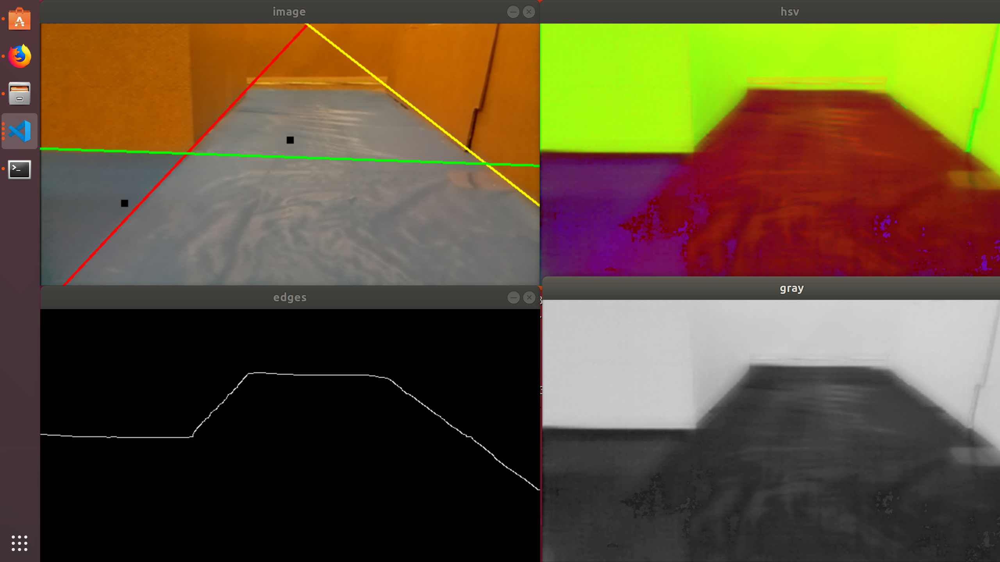
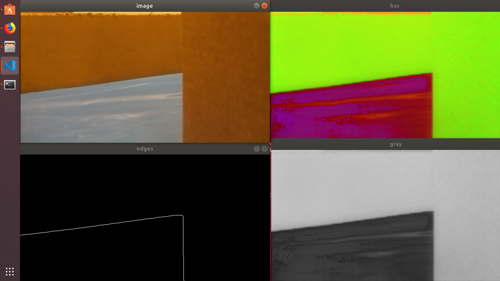
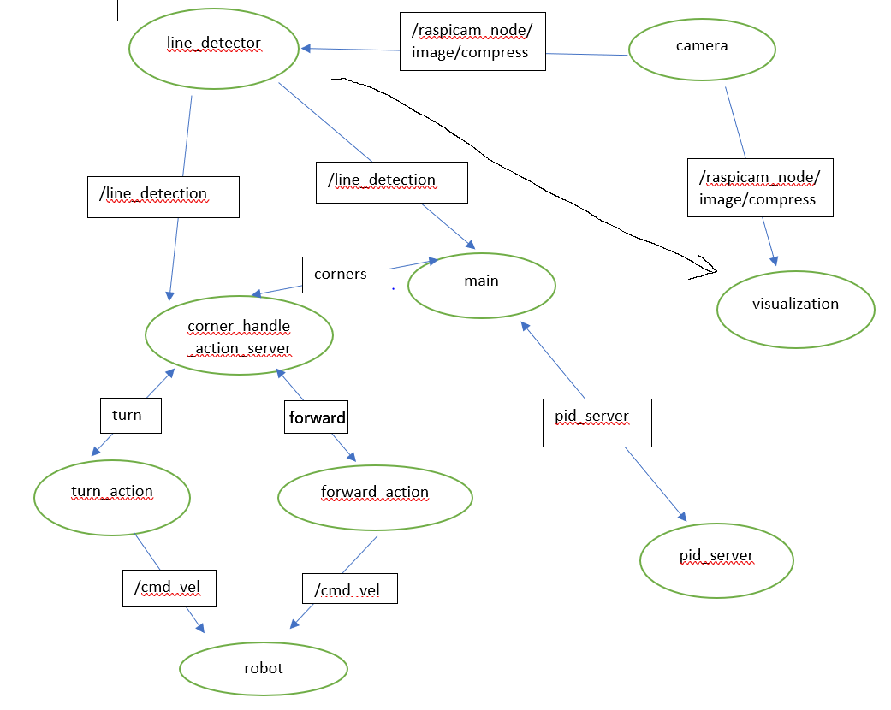
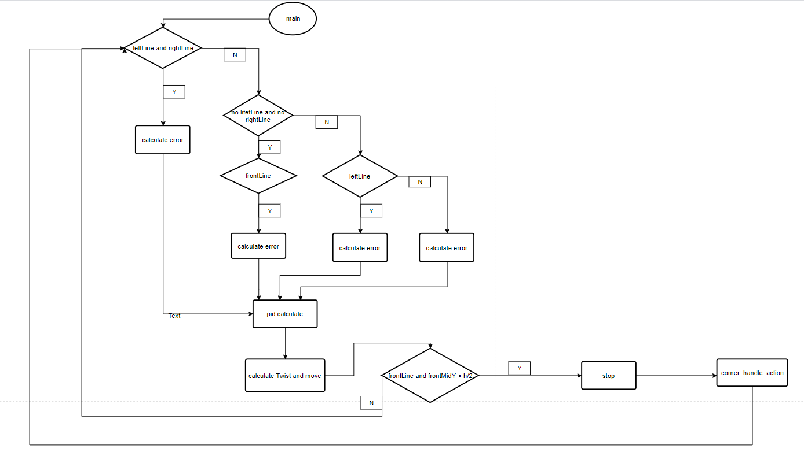

# Computer Vision Maze Solver

## Author: Zekai Wang & Zhidong Liu

### Introduction

Solving a maze is an interesting sub-task for developing real-world path schedule solutions on robots. Typically, developers prefer to use depth sensors such as lidar or depth camera to walk around in a maze, as there a lots of obstacle walls that the robot need to follow and avoid crashing. Depth sensors have their advantage to directly provide the distance data, which naturally supports the robot to navigate against the obstacles.  

However, we have come up with another idea to solve the maze using the computer vision approach. By reading articles of previous experts working on this area, we know that the RGB image cameras (CMOS or CCD) could also be used to get the depth information when they have multiple frames captured at different points of view at the same time, as long as we have the knowledge of the relative position where the frames are taken. This is basically the intuition of how human eyes work and developers have made a lot of attempts on this approach.  

Though it could calculate the depth data by using cameras no less than 2, it is not as accurate as directly using the depth sensors to measure the environment. Also, the depth calculation and 3D reconstruction requires a lot of computational resource with multiple frames to be processed at the same time. Our hardware resource might not be able to support a real-time response for this computation. So we decide not to use multiple cameras or calculate the depth, but to extract features from a single image that allows the robot to recognize the obstacles.  

The feature extraction from a single frame also requires several image processing steps. The features we chose to track are the lines in the image frames, as when the robot is in a maze boundary lines will could be detected as because walls and the floor could have different colors. We find the lines detected from the frames, which slopes are in certain ranges, are exactly the boundaries between the floor and walls. As a result, we tried serval approaches to extract these lines as the most important feature in the navigation and worked on optimization to let the robot perform more reliable.  

We also implemented several other algorithms to support the robot get out of the maze, including a pid controller. They will be introduced later.

### Relevant literature

To detect the proper lines stably, we used some traditional algorithms in the world of computer vision to process the frames step by step, including:  

1. Gaussian blur to smooth the image, providing more chance to detect the correct lines.  
https://web.njit.edu/~akansu/PAPERS/Haddad-AkansuFastGaussianBinomialFiltersIEEE-TSP-March1991.pdf  
https://en.wikipedia.org/wiki/Gaussian_blur  

2. converting image from RGB color space to HSV color space  
https://en.wikipedia.org/wiki/HSL_and_HSV  

3. convert the hsv image to gray and then binary image  

4. do Canny edge detection on the binary image  
http://citeseerx.ist.psu.edu/viewdoc/download?doi=10.1.1.420.3300&rep=rep1&type=pdf
https://en.wikipedia.org/wiki/Canny_edge_detector

5. do Hough line detection on the edges result  
http://www.ai.sri.com/pubs/files/tn036-duda71.pdf
https://en.wikipedia.org/wiki/Hough_transform

6. apply an slope filter on the lines to reliably find the boundary of the walls and the floor
   
We also implemented a pid controller for navigation. Here are some information about the pid controller:
https://en.wikipedia.org/wiki/PID_controller

### Technical descriptions, illustrations

The general idea has already been described in the above sections. In this section we will talk about the detail structure and implementation of the code.  

Some of the algorithms we are using to detect the lines have implementations in the OpenCV library. For the Gaussian, HSV conversion, gray and binary conversion, Canny edge detection and Hough line detection, OpenCV provides packaged functions to easily call and use. At beginning of the project, we just simply tried these functions around in the gazebo simulation environment, with a single script running to try to detect the edge from the scene, which are the boundaries between the floor and the walls.  

When the lines could be stably detected, we tested and adjusted in the real world. After it works properly, we tidy the code and make it a node called the line detector server. It subscribe the image from the robot's camera and always keeping to process the frames into the lines. It publishes the result as a topic where other nodes can subscribe to know about the information of the environment such as whether there is a wall or not. (As in some cases even there is a line at side, there could be no wall, we also check several pixels at the outer side of the line to determine whether there is truly a wall or not)

e.g. left line with left wall (white brick indicates a wall):  

e.g. left line with no left wall (black brick indicates a floor):  

Then, we considered about the maze configuration and determined that a maze can have 7 different kinds of possible turns, that are:  

1. crossroad
2. T-road where the robot comes from the bottom of the 'T'
3. T-road where the robot comes from the left
4. T-road where the robot comes from the right
5. left turn
6. right turn
7. dead end

We then decided that it is necessary to hard code the solution of these cases and make it an action node to let the robot turn properly as soon as one of such situation is detected. The reason of using the hard-coded solution in a turn is because when the robot walks close to the wall, the light condition will change so sharply that it could not detect the edges correctly. So we let the robot to recognize the type of the turn accurately before it enter and then move forward and/or turn for some pre-defined distances and degrees to pass this turn.  

In order to solve the problem that the pi camera's view of angle is too small, we let robot to stop before enter a turn and turn in place to look left and right for some extra angles so that it will have broad enough view to determine the situation correctly.  

e.g. left line detected correctly  

e.g. fail to detect the left line, not enough view  

e.g. turn a bit to fix the problem  

e.g. no right line, turn and no detection, correct  

This node is called corner handle action server. When the main node detects that there is a wall (line) in the front which is so near that the robot is about to enter a turn, it will send request to this corner handler to determine the case and drive over the turn.

In order to finally get out the maze, the robot also need a navigation algorithm, which is a part of the corner handler. We chose an easy approach which is the left-wall-follower. The robot will just simply turn left whenever it is possible, or go forward as the secondary choice, or turn right as the third choice, or turn 180 degrees backwards as the last choice. In this logic, the above 7 turn cases can be simplified into these 4 cases. For example, when the robot find there is a way to the left, it does not need to consider the right or front anymore and just simply turn left. When the actions (forward and turning) has been determined, the corner handle action server will send request to another two action servers to actually execute the forward and turning behaviors.

So the general idea is: when the robot detects a turn in the maze by analyzing the lines, its main node will call an action to handle the case and wait until the robot has passed that turn. In other time, the robot will use the pid algorithm to try to keep at the middle of the left and right walls in the maze, going forward until reaches the next turn. We have wrote the pid controller into a service node that the main node will send its request to calculate the robot's angular twist when the robot is not handling turns,  the error is calculated by the different of intercept of left line on x = 0 and right line on x = w (w is the width of the frame image).

In conclusion, we have this node relationship diagram  

### Discussion of interesting algorithms, modules, techniques
As above mentioned, our project is strongly relied on the accuracy of edge detection. At the begining, we only apply Gaussian filter to remove the noise in the image then just apply double threshold to determine edges. However, it does not work well. Then we try to convert the denoised  image to a hsv image and convert this hsv image into a binary image before applying canny function. Unfortunately, it does not work every time. Sometimes because of the light and shadow issue it cannot detect the desired edges. Finally, we changed our binary image generation method by considering 3 features, hue, saturation and value, rather than only one feature hue, which turns out works much more robust.

Then the workflow of our whole picture is pretty straightforward. The below flowchart describes it:

### Story of the project.
how to stablize the edges. 

### GitHub Link