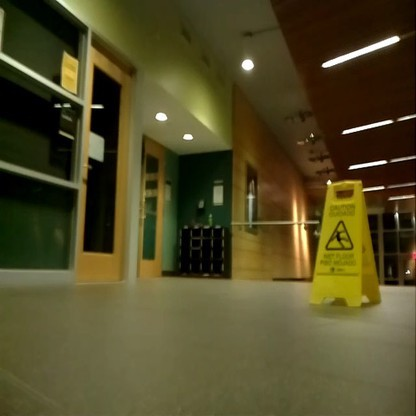
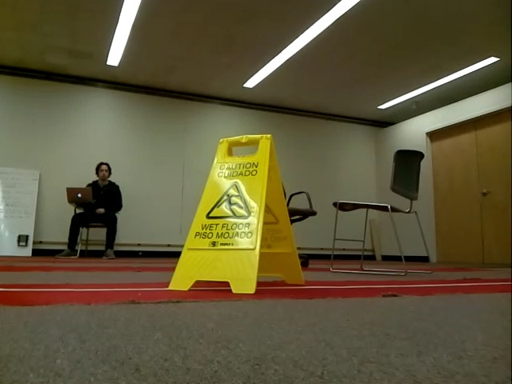
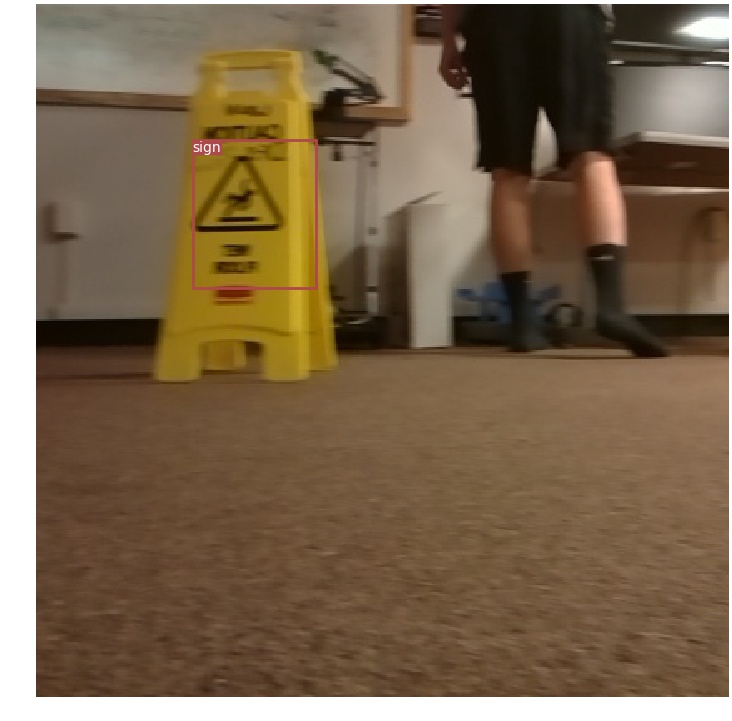
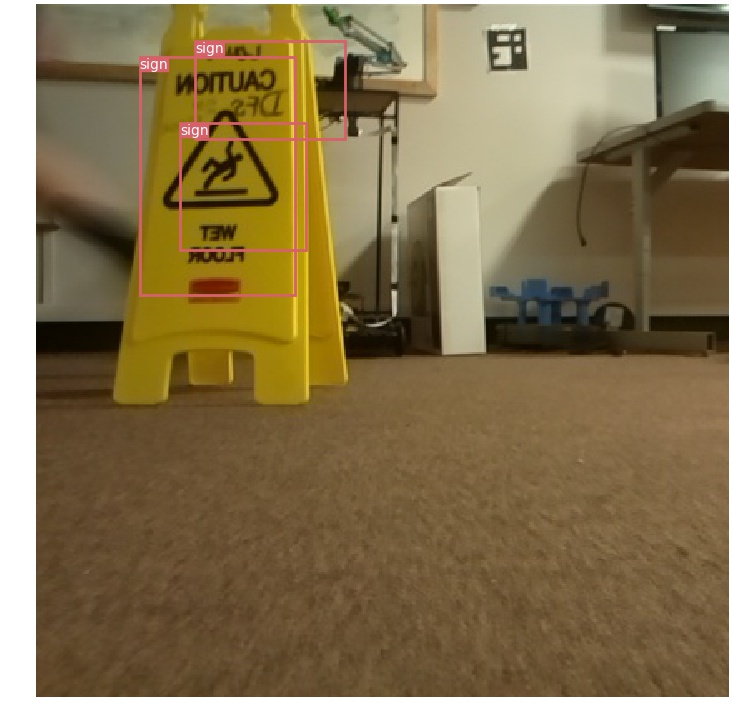

# Danger Signs

## Author: Matthew Millendorf & Jesse Yang

### Section 1 - Introduction:

Object avoidance is of the upmost importance for autonomous robotics applications. From autonomous vehicles to distribution center robots, the ability to avoid collisions is essentially to any successful robotics system. Our inspiration for this project came from the idea that the current Campus Rover significantly lacks semantic scene understanding. One type of scenes of particular concern are those that pose immediate danger to the robot.
A possible scenarios is the campus rover is delivering a package and is moving along the hallway. The floor is wet and the robot is unable to understand the meaning of the yellow wet floor sign. The robot’s navigation system avoids the wet floor sign, but the radius of the water spill is greater than the width of the wet floor sign, and the robot’s wheels hit the water puddle. There is a staircase adjacent to this spill and when the robot’s wheels make contact with water, it spirals sideways, crashing down the stairs, breaking several of its components and the contents of the package. Our aim in this project is to provide a way for robots to avoid these scenarios through recognition of the trademark wet floor signs.
The following report will go as follows. In section II, we will dive into relevant literature concerning our problem. Following that, we will detail our process and the difficulties we faced. Finally, in Section IV, we will provide a reflection of how our project went.


### Section 2 - Relevant Literature:

The use of deep convolutional neural networks has enjoyed unprecedented success over the past decade in applications everywhere from facial recognition to autonomous navigation in vehicles. Thus, it seemed appropriate for our project that such techniques would be optimal. We decided our best methodology for allowing a robot to ‘understand’ a wet floor sign was to train a deep convolutional neural network on images of a yellow wet floor sign.
Upon further research of this problem statement and methodology, we discovered a research paper from ETH Zurich that seemed to best fit our needs. The paper, written in 2018, details how ETH Zurich’s Autonomous Formula One Racing Team computes the 3D pose of the traffic cones lining the track. Although we only have about six weeks to complete our project, we ambitiously set out to replicate their results. We would take their methodology and apply it to our wet floor sign problem.
Their methodology consisted of three main phases. Phase 1 would be to perform object detection on a frame inputted from the racing car’s camera and output the 2D location of the traffic cone. We specify 2D because it is important to note that detection of obstacles in an image frame consists not of two coordinates, but of three. In this first phase, the researchers from ETH Zurich were only concerned with the computation of the location of bounding boxes around the cone within the frame. The output of this model would provide a probability that the detected bounding box contains a cone and what the x- and y-coordinates of the bounding box were in the image frame.
The neural network architecture employed by the researchers was the YoloV3 architecture. Additionally, the researches trained this network on 2,000 frames labelled with the bounding box coordinates around the cones.
In the second phase of the paper, a neural network was trained to regress the location of key points of the cones. For instance, the input to this network was the cropped bounding box region of where a cone was in the frame. This cropped image was then labelled with ‘key points’, specific locations on the cone that the second neural network would be trained.
From there, once we have at least four points on the cone, knowing the geometry of the cone and calibration of the camera, the perspective n-points can be used to find the 3D pose of the cone.


### Section 3 - Our Process:

Using the research paper as our guidelines, we set out to replicate their results. First came building the dataset that would be used for training both of our neural networks. We needed a yellow wet floor sign so we took one from a bathroom in Rabb. Over the course of two weeks, we teleoperated a Turtlebot3 around various indoor environments, driving it into the yellow wet floor sign, recording the camera data.
From there, we labelled over 2,000 frames, placing bounding boxes around the yellow wet floor sign. This was by far the most tedious process we faced. From there, we needed to find a way to train a neural network to generalize on new frames. Upon further research, we came across a GitHub repository that was an implementation of the Yolov3 architecture in Keras and Python. There was quite a bit of configuration but we eventually were able to clone the repository onto our local machines and pass our data through it.
However, the passing of data through our network required a significant amount of computation, and hence, we encountered our first roadblock. Needing a computer with greater computational resources, we turned to the Google Cloud Platform. We created a new account and were given a trial $300 in cloud credits. We created a virtual machine that we added two P100 GPUs. Graphic processing units are processors specifically made for rendering graphics. Although we were not rendering graphics, GPUs are used to processing tensors and thus, would perform the tensor and matrix computations at each node of the neural network with greater speed than standard central processing units. Once we trained a model to recognize the yellow wet floor signs, we turned our attention over to the infrastructure side of our project. This decision to focus on incremental steps proved to be our best decision yet as this was the aspect of our project with the most amount of bottlenecks.
When trying to create our program, we encountered several errors with using Keras in the ROS environment. Notorious to debug, there were several errors within the compilation and execution of the training of the neural network that were impossible to solve after a couple weeks of figuring it out. We pivoted once again, starting from scratch and training a new implementation of the Yolov3 architecture. However, this repository was written in Pytorch, an API for deep learning that was more compatible with the ROS environment.





Using Torch instead of Keras, we moved towards repositories and restarted training with our old dataset. In this particular pivot, we approximately ~500 frames from the old 2,000 frame dataset was relabeled in Pascal VOC format instead of YOLO weights format. This decision was made to make training easier on Jesse's GPU. To replicate our training of YOLO weights on a custom data set, we followed this process below:

Firstly, decide upon an annotation style for the dataset. We initially had annotations in YOLO formats and then in Pascal VOC formats. These are illustrated below.

##### Example Pascal VOC annotation

Each frame should have an accompanied annotation file. Example ('atrium.jpg' and 'atrium.xml'). Pascal VOC is in XML format, and should include the path, height, width, and channels for the image. In addition, there should be the class of the image in the name section, as well as any bounding boxes (including their respective x and y).

```
  <annotation>
  	<folder>signs_images</folder>
  	<filename>atriuma2.jpg</filename>
  	<path>/Users/jesseyang/Desktop/signs_images/atriuma2.jpg</path>
  	<source>
  		<database>Unknown</database>
  	</source>
  	<size>
  		<width>416</width>
  		<height>416</height>
  		<depth>3</depth>
  	</size>
  	<segmented>0</segmented>
  	<object>
  		<name>sign</name>
  		<pose>Unspecified</pose>
  		<truncated>0</truncated>
  		<difficult>0</difficult>
  		<bndbox>
  			<xmin>232</xmin>
  			<ymin>218</ymin>
  			<xmax>281</xmax>
  			<ymax>290</ymax>
  		</bndbox>
  	</object>
  </annotation>
```

##### Example YOLO annotation

Similarly, each frame should have an accompanying text file. For example ('atrium.jpg' and 'atrium.txt'). These should also be in the same directory with the same name.

In this txt file, each line of the file should represent an object which an object number, and its coordinates in the image.
As seen below in the form of:

line: object-class x y width height

The object class should be an integer that is represented on the names file that the training script shall read from. (0 - Dog, 1 - Cat, etc).

The x, y, width, and height, should be float values that are to the width and height of the image (these are floats between 0.0 and 1.0)


```
1 0.716797 0.395833 0.216406 0.147222
0 0.687109 0.379167 0.255469 0.158333
1 0.420312 0.395833 0.140625 0.166667
```

##### Training Configurations

As we were retraining weights from PJReddie's site.
[PJReddie YOLO](https://pjreddie.com/darknet/yolo/). It is here that one can find some of the pretrained weights for different YOLO implementations and their performance in mAP and FLOPS on the COCO dataset. The COCO dataset is a popular dataset for training in object detection and is called the Common Objects in Context dataset that includes over a quarter of a million images.

For our initial training, we used the YOLOv3-416 configuration and weights for 416 by 416 sized images, as well as the YOLOv3 tiny configuration and weights in the event of latency issues. Modifications were made in the yolov3.cfg file that we used for training for our single class inference.

Since we are doing single class detection our data and names file looks as so:

```
classes=1
train=data/signs/train.txt
valid=data/signs/val.txt
names=config/coco.names
backup=backup/
```

```
sign
```

Fairly sparse as one can see, but easily modifiable in the event of training multiple class objects.

Actual training was done using the train.py script in our github repo. We played around with a couple hyper-parameters, but stuck with 25 epochs training in batch sizes of 16 on the 500 Pascal VOC labeled frames. Even with only 20 epochs, training on Jesse's slow GPU took approximately 20 hours.

Unfortunately, valuable data on our loss, recall, and precision were lost as laptop used to train unexpectedly died overnight during the training process. Lack of foresight resulted in not being able to collect these metrics during the training as they were to be conglomerated after every epoch finished. Luckily, the weights of 19 epochs were recovered in checkpoints however their performance had to be manually tested.

##### Prediction

Inference via the turtlebot3s are done via a ROS node on a laptop that subscribes to the turtlebot's rpi camera, does some minor image augmentations and then saves the image to a 'views' directory. From this directory, a YOLO runner program is checking for recently modified files, then subsequently performs inference, draws bounding box predictions on said files and then writes to a text file with results as well as the modified frame.

The rational behind reading and writing files instead of predicting on ROS nodes from the camera is a result of struggles throughout the semester to successfully integrate Tensorflow graphs onto the ROS system. We ran into numerous session problems with Keras implementations, and ultimately decided on moving nearly all of the processing from the turtlebot3 into the accompanying laptop. This allows us to (nearly) get inference real time given frames from the turtlebot3.




An alternate way of doing inference, but in this case doing object detection with items with the COCO dataset rather than our custom dataset can be run via our yolo_runner.py node directly on ROS. This is an approach that does not utilize read/write and instead prints predictions and bounding boxes to the screen. However, with this approach drawing to the screen was cut due to how it lagged the process when attempting to perform inference on the turtlebot3's frames.

### Section 4 - Reflection

This project was a strong lesson in the risks of attempting a large project in a short time span that combines two complex fields within computer science (Robotics and Machine Learning) whilst learning much of it on the go. It was quite humbling to be very ambitious with our project goals and fall short of many of the "exciting" parts of the project. However, it was also a pleasure to have the freedom to work on and learn continuously while attempting to deploy models and demos to some fairly cutting edge problems. Overall, this made the experience a learning experience that resulted in not only many hours of head-banging and lost progress but also a deeper appreciation for the application of computer vision in robotics and the challenges of those who helped pave the way for our own small success.

References:
https://github.com/eriklindernoren/PyTorch-YOLOv3
https://github.com/qqwweee/keras-yolo3
https://pjreddie.com/darknet/yolo/
https://github.com/cfotache/pytorch_objectdetecttrack
