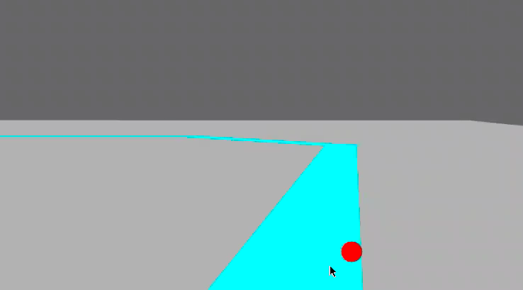
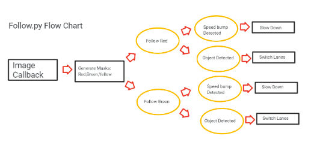
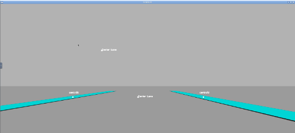

# Robot Race

Project Report for Robot Race <br>
Team: Sampada Pokharel (pokharelsampada@brandeis.edu) and Jalon Kimes (jkimes@brandeis.edu) <br>
Date: May 4, 2023<br>
Github repo: https://github.com/campusrover/robot_race

## Introduction

### Background

For our final project, we wanted to create a dynamic and intuitive project that involved more than one robot. To challenge ourselves, we wanted to incorporate autonomous robots. As the technology for self-driving cars continues to advance, we are curious about the process involved in creating these vehicles and wanted to explore the autonomous robot development process. To explore this further, we have come up with the concept of a race between two autonomous robots. The goal for this project was to program robots into racing in the track indefinitely all while following certain rules and avoiding obstacles throughout the track.

## Original Objectives

Our main objective is for the robots to autonomously move itself in the race track with 2 lanes (4 lines) avoiding any collision. The plan was to do so by following the center of a lane made by 2 lines, slowing down, and switching into a different lane. We were able to use the contour system to detect multiple objects within a mask and draw centroids on them. For our purposes we wanted it to detect the two lines that make up the lane. With the centroids we could calculate the midpoint between the lines and follow that. We got a prototype running, however it struggled to turn corners. For the sake of time we pivoted to only following one line per robot. The current Robot Race is an algorithm that allows two autonomous robots to race each other, collision free, on a track with two lines, speed bumps, and obstacles along the way.

## What was created

## Technical Description and Illustrations

We designed our code to have the robot recognize a line by its color and follow it. While it is doing that it is also looking for yellow speed bumps along the track. When it detects yellow on the tract the robot will slow down until it passes over the speed bump. Furthermore, when the robot detects an obstacle in front of it, it will switch lanes to move faster avoiding the obstacle.

## Discussion of interesting algorithms, modules, techniques

The main package that drives our project is the opencv stack. This contains a collection of tools that allow us to use computer vision to analyze images from the camera on the robot. We used the CV bridge package to process the images. As the name suggests CV bridge allows us to convert the ROS messages into OpenCV messages. The camera onboard the robot publishes the images as ROS messages into different types of CV2 images. For our use case, we converted the images from the camera into color masks. To create the color masks we used the HSV color code to set upper and lower bounds for the range of colors we want the mask to isolate. For example, for red the lower bound was: HSV [0,100,100] and the upper bound was: HSV [10,255,255]. The mask will then block out any color values that are not in that range.



Figure 1

To figure out the color code we had to calibrate the camera for both robots using the cvexample.py file with the RQT app to adjust the HSV mask range live. After that we convert the color mask to a grayscale image and it's ready for use.

We created masks for the green and red lines that the robot will follow and the yellow speed bumps scattered along the track. We set each robot to follow a specific line and also be scanning for yellow at the same time. This was achieved by drawing centroids on the line (red or green) for the robot to follow.

We also use lidar in our project. Each robot is scanning the environment for obstacles. The robots have the ability to switch lanes by swapping the red and green masks out when it detects an obstacle on the track with lidar. We subscribed to the laser scan topic to receive ros messages from the equipped Lidar sensor. After some testing and experimenting we decided If It detects an object within 1.5 meters of the front of the robot it will switch lanes. We had to make sure that the distance threshold was far enough for the robot to switch lanes before crashing but not too far to detect the chairs and tables in the room.

## Guide on how to use the code written

1. Clone our repository: “git clone https://github.com/campusrover/robot_race.git”
2. ssh into two robots
   for each robot run:
   ```bash
        $(bru mode real)
       $(bru name <robot name> -m <myvpnip>)
       multibringup
   ```
3. Go into vnc and run roslaunch robot_race follow_demo.launch

This should get the robots to move on their respective lines.

## Source files, nodes, messages, and actions

Launch File
Follow_demo.launch - The main launch file for our project

Nodes
Follow.py - main programming node



## Story of the project

## How it unfolded

At the very beginning, we were dancing with the idea of working on two robots and having them follow the traffic rules as they start racing on the track for our final project. However, as we started learning more about image processing and worked on the line following PA, we wanted to challenge ourselves to work with two autonomous robots. With the autonomous robots in mind, we then decided to discard the traffic lights and just create a simple track with speed bumps and walls on the lanes.

We faced many problems throughout this project and pivoted numerous times. Although the project sounds simple, it was very difficult to get the basic algorithm started. One of our biggest challenges was finding a way for the robot to stay in between two lanes. We tried to use the HoughLines algorithm to detect the lines of our lanes, however, we found it extremely difficult to intricate our code as HoughLines detected odd lines outside of our track. When HoughLines didn’t work, we pivoted to using a contours-based approach. Contours allow you to recognize multiple objects in a mask and draw centroids on them. We used this to draw centroids on the two lines and calculated the midpoint in between two lines for the robot to follow. While we were successful in creating a centroid in between the lines for the robot to follow on the gazebo, when we tried to run the program on the actual robot, the robot did not stay in between the two lanes when it needed to turn a corner(Figure 2). At last, we pivoted and decided to replace the lanes with two different tapes, red and green, for the robots to follow.



Figure 2

Furthermore, we wanted to create an actual speed bump using cardboards but we soon realized that would be a problem since we wanted to use the small turtle bots for our project and they were unable to slow down and go up the speed bump. Furthermore, the lidars are placed at the top of the robot and there is little to no space at the bottom of the robot to place a lidar. A solution we came up with was to use yellow tape to signal speed bumps.

Once we were able to get the robots to follow the two lines, we had difficulty getting the robot to slow down when it detected the speed bump. We had separated the main file and the speed bump detector file. The speed bump detector file created a yellow mask and published a boolean message indicating if yellow was detected in the image. After discussing it with the TA and some friends from class we found out that we could not pass the boolean messages from the speedbump node to the main file without changing the xml file. We originally planned to do the same for object detection but did not want to run into the same problem. Our solution was to combine everything into one file and the speed bump and object detector nodes became methods.

## Self assessment

Overall, we consider this project to be a success. We were able to create and run two autonomous robots simultaneously and have them race each other on the track all while slowing down and avoiding obstacles. Although we faced a lot of challenges along the way, we prevailed and were able to finish our project on time. The knowledge and experience gained from this project are invaluable, not only in the field of self-driving cars but also in many other areas of robotics and artificial intelligence. We also learned the importance of teamwork, communication, and problem-solving in the development process. These skills are highly transferable and will undoubtedly benefit us in our future endeavors.
